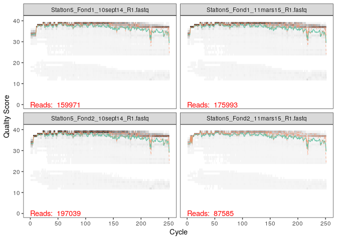

Analyse des donées avec Dada2
================
Vincent Noah
19 décembre 2020

  - [Préparation de l’environnement.](#préparation-de-lenvironnement.)
  - [Inspecter les profils de qualité des
    lectures.](#inspecter-les-profils-de-qualité-des-lectures.)
  - [Filtration et tronquage.](#filtration-et-tronquage.)
  - [Connaitre le taux d’erreur.](#connaitre-le-taux-derreur.)
  - [Inférence d’échantillon.](#inférence-déchantillon.)
  - [Alignement des R1 et R2 en
    contigs.](#alignement-des-r1-et-r2-en-contigs.)
  - [Construction de la table
    d’observation.](#construction-de-la-table-dobservation.)
  - [Détection de chimères.](#détection-de-chimères.)
  - [Pourcentage de séquences chimérique dans l’ensemble de la
    table.](#pourcentage-de-séquences-chimérique-dans-lensemble-de-la-table.)
  - [Téléchargement des bases de donées et assignation d’un
    taxonomique.](#téléchargement-des-bases-de-donées-et-assignation-dun-taxonomique.)

# Préparation de l’environnement.

On commence par charger le package dada2 pour pouvoir utiliser les
fonctions lors de l’analyse.

``` r
library(Rcpp)
library(dada2)
```

    ## Warning: multiple methods tables found for 'which'

Les données contenues dans St\_Stratif sont des séquences d’ARN 16s à
partir d’échantillons d’eau de mer de la rade de Brest, obtenu par
séquençage illumina. St\_Stratif contient donc les forwards et les
reverses. On va créer un objet path dans lequel on va mettre toutes les
données de Miseq\_SOP. On vérifie par la suite les fichiers contenus
dans path avec la commande list.files

``` r
path <- "~/St_Stratif"
list.files(path)
```

    ##  [1] "filtered"                            "Station5_Fond1_10sept14_R1.fastq"   
    ##  [3] "Station5_Fond1_10sept14_R2.fastq"    "Station5_Fond1_11mars15_R1.fastq"   
    ##  [5] "Station5_Fond1_11mars15_R2.fastq"    "Station5_Fond2_10sept14_R1.fastq"   
    ##  [7] "Station5_Fond2_10sept14_R2.fastq"    "Station5_Fond2_11mars15_R1.fastq"   
    ##  [9] "Station5_Fond2_11mars15_R2.fastq"    "Station5_Fond3_10sept14_R1.fastq"   
    ## [11] "Station5_Fond3_10sept14_R2.fastq"    "Station5_Median1_10sept14_R1.fastq" 
    ## [13] "Station5_Median1_10sept14_R2.fastq"  "Station5_Median2_10sept14_R1.fastq" 
    ## [15] "Station5_Median2_10sept14_R2.fastq"  "Station5_Surface1_10sept14_R1.fastq"
    ## [17] "Station5_Surface1_10sept14_R2.fastq" "Station5_Surface1_11mars15_R1.fastq"
    ## [19] "Station5_Surface1_11mars15_R2.fastq" "Station5_Surface2_10sept14_R1.fastq"
    ## [21] "Station5_Surface2_10sept14_R2.fastq" "Station5_Surface2_11mars15_R1.fastq"
    ## [23] "Station5_Surface2_11mars15_R2.fastq"

Une fois que l’on a observé et vérifié le contenu des fichiers dans
path, on peut trier ces fichiers dans différents objets pour permettre
l’analyse. On va donc créer l’objet fnFs qui contiendra tous les
forwards, en indiquant à R de mettre tous les fichiers contenant le
format \_R1.fastq dans fnFs tout en gardant le nom entier des fichiers
avec la commande full.name= TRUE. On réitère les mêmes opérations pour
les Reverses (R2) avec l’objet fnRs. Afin de faciliter l’analyse et pour
ne pas avoir des noms trop longs, on va “simplifier” les noms des
fichiers fnFs avec la commande sapply en précisant à R que l’on veut
enlever toutes les chaines de caractères (strsplit) après le "\_R1",
puis on va mettre ces noms simplifiés dans un nouvel objet appelé
sample.name

``` r
fnFs <- sort(list.files(path, pattern="_R1.fastq", full.names = TRUE))
fnRs <- sort(list.files(path, pattern="_R2.fastq", full.names = TRUE))
# Extract sample names, assuming filenames have format: SAMPLENAME_XXX.fastq
sample.names <- sapply(strsplit(basename(fnFs), "_R"), `[`, 1)
```

# Inspecter les profils de qualité des lectures.

Une fois l’environnement préparé, on va maintenant inspecter les scores
de qualité des FnFs, en traçant un graphique (plot) comprenant les
fichiers fnFs 1 à 4. Ce graphique va nous permettre de visualiser les
pertes significatives de qualité, et donc nous permettre de savoir sur
quel nucléotide ou va pouvoir “couper” pour obtenir des séquences plus
nettes.

  - On observe que les forwards sont plutôt de bonne qualité. C’est pour
    cela que l’on va décider de ne pas tronquer.

<!-- end list -->

``` r
plotQualityProfile(fnFs[1:4])
```

<!-- -->

  - Les Reverse reads possède un score de qualité nettement inférieur
    par rapport au forward reads. C’est un phénomène courant lors du
    séquençage illumina. En effet, on observe une chute de la qualité à
    partir du nucléotide 150. Cependant on ne peut pas tout tronquer (il
    faut penser à l’alignement). C’est pour cela que l’on a décidé de
    tronquer à partir de nucléotide 200.

<!-- end list -->

``` r
plotQualityProfile(fnRs[1:4])
```

<!-- -->

# Filtration et tronquage.

On commence par créer deux fichiers (filtFs et filrRs) où on va
regrouper les fichiers fasq, une fois qu’ils seront filtrés, en
utilisant les noms simplifiés.

``` r
filtFs <- file.path(path, "filtered", paste0(sample.names, "_F_filt.fastq.gz"))
filtRs <- file.path(path, "filtered", paste0(sample.names, "_R_filt.fastq.gz"))
names(filtFs) <- sample.names
names(filtRs) <- sample.names
```

Tout d’abord, avec la fonction TimLeft=21, on indique a R de tronquer
les amorces. Ensuite, on indique à R que l’on veut tronquer les forwards
à partir du nucléotide 250 ce qui correspond à aucun tronquage. Pour les
reverses on indique à R de couper à partir du nucléotide 200.

``` r
out <- filterAndTrim(fnFs, filtFs, fnRs, filtRs, truncLen=c(250,200),trimLeft = (21),
              maxN=0, maxEE=c(2,2), truncQ=2, rm.phix=TRUE,
              compress=TRUE, multithread=TRUE) # On Windows set multithread=FALSE
head(out)
```

    ##                                    reads.in reads.out
    ## Station5_Fond1_10sept14_R1.fastq     159971    145031
    ## Station5_Fond1_11mars15_R1.fastq     175993    159807
    ## Station5_Fond2_10sept14_R1.fastq     197039    176477
    ## Station5_Fond2_11mars15_R1.fastq      87585     79696
    ## Station5_Fond3_10sept14_R1.fastq     117140    105805
    ## Station5_Median1_10sept14_R1.fastq   116519    106244

# Connaitre le taux d’erreur.

``` r
errF <- learnErrors(filtFs, multithread=TRUE)
```

    ## 110221135 total bases in 481315 reads from 3 samples will be used for learning the error rates.

``` r
errR <- learnErrors(filtRs, multithread=TRUE)
```

    ## 100420969 total bases in 561011 reads from 4 samples will be used for learning the error rates.

  - La ligne noire montre le taux d’erreurs estimé avec learnErrors.

  - La ligne en rouge montre le taux d’erreur observé.

  - On observe qu’il y a peu de différence.

<!-- end list -->

``` r
plotErrors(errF, nominalQ=TRUE)
```

    ## Warning: Transformation introduced infinite values in continuous y-axis
    
    ## Warning: Transformation introduced infinite values in continuous y-axis

<!-- -->

# Inférence d’échantillon.

Le package Dada2 contient un algorithme d’interférence aux données que
nous venons juste de filtrer et de tronquer. Cela nous permet d’enlever
les bruits de fond, pour les R1 et les R2.

``` r
dadaFs <- dada(filtFs, err=errF, multithread=TRUE)
```

    ## Sample 1 - 145031 reads in 39978 unique sequences.
    ## Sample 2 - 159807 reads in 37782 unique sequences.
    ## Sample 3 - 176477 reads in 49703 unique sequences.
    ## Sample 4 - 79696 reads in 21434 unique sequences.
    ## Sample 5 - 105805 reads in 31881 unique sequences.
    ## Sample 6 - 106244 reads in 30070 unique sequences.
    ## Sample 7 - 98411 reads in 26954 unique sequences.
    ## Sample 8 - 106995 reads in 28021 unique sequences.
    ## Sample 9 - 70842 reads in 18914 unique sequences.
    ## Sample 10 - 78294 reads in 21347 unique sequences.
    ## Sample 11 - 91238 reads in 25826 unique sequences.

``` r
dadaRs <- dada(filtRs, err=errR, multithread=TRUE)
```

    ## Sample 1 - 145031 reads in 45252 unique sequences.
    ## Sample 2 - 159807 reads in 41345 unique sequences.
    ## Sample 3 - 176477 reads in 55267 unique sequences.
    ## Sample 4 - 79696 reads in 23050 unique sequences.
    ## Sample 5 - 105805 reads in 34435 unique sequences.
    ## Sample 6 - 106244 reads in 31383 unique sequences.
    ## Sample 7 - 98411 reads in 28878 unique sequences.
    ## Sample 8 - 106995 reads in 28735 unique sequences.
    ## Sample 9 - 70842 reads in 21298 unique sequences.
    ## Sample 10 - 78294 reads in 21877 unique sequences.
    ## Sample 11 - 91238 reads in 28105 unique sequences.

# Alignement des R1 et R2 en contigs.

Grâce à la fonction mergerPair, on va pouvoir maintenant aligner les R1
et R2 pour former des contigs. Dans les arguments de cette fonction on
précise que l’on utilise les fichiers filtrés et tronqués. On va stoquer
ces données dans un nouvel objet mergers. La sortie, nous montre les
séquences qui ont pu être alignées en contigs par rapport à l’ensemble
des séquences.

``` r
mergers <- mergePairs(dadaFs, filtFs, dadaRs, filtRs, verbose=TRUE)
```

    ## 115473 paired-reads (in 4595 unique pairings) successfully merged out of 140326 (in 21160 pairings) input.

    ## 136539 paired-reads (in 3685 unique pairings) successfully merged out of 155618 (in 15520 pairings) input.

    ## 139935 paired-reads (in 6236 unique pairings) successfully merged out of 170590 (in 26605 pairings) input.

    ## 66207 paired-reads (in 2312 unique pairings) successfully merged out of 77396 (in 9469 pairings) input.

    ## 82090 paired-reads (in 3117 unique pairings) successfully merged out of 101553 (in 16083 pairings) input.

    ## 85833 paired-reads (in 3244 unique pairings) successfully merged out of 102767 (in 13959 pairings) input.

    ## 80200 paired-reads (in 2622 unique pairings) successfully merged out of 95148 (in 12056 pairings) input.

    ## 89039 paired-reads (in 3012 unique pairings) successfully merged out of 103729 (in 11950 pairings) input.

    ## 58701 paired-reads (in 1682 unique pairings) successfully merged out of 68495 (in 7924 pairings) input.

    ## 65924 paired-reads (in 1731 unique pairings) successfully merged out of 76263 (in 8159 pairings) input.

    ## 73150 paired-reads (in 2621 unique pairings) successfully merged out of 87831 (in 11884 pairings) input.

``` r
# Inspect the merger data.frame from the first sample
head(mergers[[1]])
```

    ##                                                                                                                                                                                                                                                                                                                                                                                sequence
    ## 1     TACGAAGGGACCTAGCGTAGTTCGGAATTACTGGGCTTAAAGAGTTCGTAGGTGGTTGAAAAAGTTAGTGGTGAAATCCCAGAGCTTAACTCTGGAACTGCCATTAAAACTTTTCAGCTAGAGTATGATAGAGGAAAGCAGAATTTCTAGTGTAGAGGTGAAATTCGTAGATATTAGAAAGAATACCAATTGCGAAGGCAGCTTTCTGGATCATTACTGACACTGAGGAACGAAAGCATGGGTAGCGAAGAGGATTAGATACCCTCGTAGTCCATGCCGTAAACGATGTGTGTTAGACGTTGGAAATTTATTTTCAGTGTCGCAGGGAAACCGATAAACACACCGCCTGGGGAGTACGACCGCAAGGTT
    ## 2     TACGAAGGGACCTAGCGTAGTTCGGAATTACTGGGCTTAAAGAGTTCGTAGGTGGTTGAAAAAGTTGGTGGTGAAATCCCAGAGCTTAACTCTGGAACTGCCATCAAAACTTTTCAGCTAGAGTATGATAGAGGAAAGCAGAATTTCTAGTGTAGAGGTGAAATTCGTAGATATTAGAAAGAATACCAATTGCGAAGGCAGCTTTCTGGATCATTACTGACACTGAGGAACGAAAGCATGGGTAGCGAAGAGGATTAGATACCCTCGTAGTCCATGCCGTAAACGATGTGTGTTAGACGTTGGAAATTTATTTTCAGTGTCGCAGCGAAAGCGATAAACACACCGCCTGGGGAGTACGACCGCAAGGTT
    ## 3     TACGAAGGGACCTAGCGTAGTTCGGAATTACTGGGCTTAAAGAGTTCGTAGGTGGTTGAAAAAGTTGGTGGTGAAATCCCAGAGCTTAACTCTGGAACTGCCATCAAAACTTTTCAGCTAGAGTTTGATAGAGGAAAGCAGAATTTCTAGTGTAGAGGTGAAATTCGTAGATATTAGAAAGAATACCAATTGCGAAGGCAGCTTTCTGGATCATTACTGACACTGAGGAACGAAAGCATGGGTAGCGAAGAGGATTAGATACCCTCGTAGTCCATGCCGTAAACGATGTGTGTTAGACGTTGGAAATTTATTTTCAGTGTCGCAGCGAAAGCGATAAACACACCGCCTGGGGAGTACGACCGCAAGGTT
    ## 4     TACGAAGGGACCTAGCGTAGTTCGGAATTACTGGGCTTAAAGAGTTCGTAGGTGGTTGAAAAAGTTAGTGGTGAAATCCCAGAGCTTAACTCTGGAACTGCCATTAAAACTTTTCAGCTAGAGTATGATAGAGGAAAGCAGAATTTCTAGTGTAGAGGTGAAATTCGTAGATATTAGAAAGAATACCAATTGCGAAGGCAGCTTTCTGGATCATTACTGACACTGAGGAACGAAAGCATGGGTAGCGAAGAGGATTAGATACCCTCGTAGTCCATGCCGTAAACGATGTGTGTTAGACGTTGGAAATTTATTTTCAGTGTCGCAGCGAAAGCGATAAACACACCGCCTGGGGAGTACGACCGCAAGGTT
    ## 5     TACGAAGGGACCTAGCGTAGTTCGGAATTACTGGGCTTAAAGAGTTCGTAGGTGGTTGAAAAAGTTGGTGGTGAAATCCCAGAGCTTAACTCTGGAACTGCCATCAAAACTTTTCAGCTAGAGTATGATAGAGGAAAGCAGAATTTCTAGTGTAGAGGTGAAATTCGTAGATATTAGAAAGAATACCAATTGCGAAGGCAGCTTTCTGGATCATTACTGACACTGAGGAACGAAAGCATGGGTAGCGAAGAGGATTAGATACCCTCGTAGTCCATGCCGTAAACGATGTGTGTTAGACGTTGGAAATTTATTTTCAGTGTCGCAGGGAAACCGATAAACACACCGCCTGGGGAGTACGACCGCAAGGTT
    ## 6 TACGAGGGGTCCTAGCGTTGTCCGGATTTACTGGGCGTAAAGGGTACGTAGGCGTTTTAATAAGTTGTATGTTAAATATCTTAGCTTAACTAAGAAAGTGCATACAAAACTGTTAAGATAGAGTTTGAGAGAGGAACGCAGAATTCATGGTGGAGCGGTGACATGCGTAGATATCATGAGGAAAGTCAAATGCGAAGGCAGCCTTCTGGCTCAAAACTGACGCTGAGGTACGAAAGCGTGGGGAGCGAACAGGATTAGATACCCTGGTAGTCCACGCCGTAAACGATGAGTATTTGGTGCTGGGGGATTCGACCCTTTCAGTGCCGTAGCTAACGCGATAAATACTCCGCCTGGGGACTACGATCGCAAGATT
    ##   abundance forward reverse nmatch nmismatch nindel prefer accept
    ## 1      5170       1       2     39         0      0      2   TRUE
    ## 2      4127       2       1     39         0      0      2   TRUE
    ## 3      3781       3       1     39         0      0      2   TRUE
    ## 4      2481       1       1     39         0      0      2   TRUE
    ## 5      2176       2       2     39         0      0      2   TRUE
    ## 6      2130       5       9     35         0      0      1   TRUE

# Construction de la table d’observation.

On va maintenant créer une table de séquences grâce à la fonction
“makeSequenceTable” à partir des contigs obtenus et placé dans l’objet
mergers.

``` r
seqtab <- makeSequenceTable(mergers)
dim(seqtab)
```

    ## [1]    11 17389

# Détection de chimères.

``` r
seqtab.nochim <- removeBimeraDenovo(seqtab, method="consensus", multithread=TRUE, verbose=TRUE)
```

    ## Identified 15867 bimeras out of 17389 input sequences.

``` r
dim(seqtab.nochim)
```

    ## [1]   11 1522

# Pourcentage de séquences chimérique dans l’ensemble de la table.

On peut déterminer le pourcentage du taux de chimères. On trouve qu’il y
a 78 % de séquences chimérique dans notre jeu de donnée.

``` r
1-sum(seqtab.nochim)/sum(seqtab)
```

    ## [1] 0.2159258

On peut observer toutes les étapes qui ont été réalisées.

``` r
getN <- function(x) sum(getUniques(x))
track <- cbind(out, sapply(dadaFs, getN), sapply(dadaRs, getN), sapply(mergers, getN), rowSums(seqtab.nochim))
# If processing a single sample, remove the sapply calls: e.g. replace sapply(dadaFs, getN) with getN(dadaFs)
colnames(track) <- c("input", "filtered", "denoisedF", "denoisedR", "merged", "nonchim")
rownames(track) <- sample.names
print(track)
```

    ##                             input filtered denoisedF denoisedR merged nonchim
    ## Station5_Fond1_10sept14    159971   145031    142239    142879 115473   87651
    ## Station5_Fond1_11mars15    175993   159807    157275    157884 136539  110945
    ## Station5_Fond2_10sept14    197039   176477    172714    174073 139935  103398
    ## Station5_Fond2_11mars15     87585    79696     78289     78639  66207   54402
    ## Station5_Fond3_10sept14    117140   105805    103125    104001  82090   63805
    ## Station5_Median1_10sept14  116519   106244    104130    104717  85833   65324
    ## Station5_Median2_10sept14  108673    98411     96404     97022  80200   62534
    ## Station5_Surface1_10sept14 118057   106995    105030    105581  89039   69034
    ## Station5_Surface1_11mars15  77940    70842     69460     69675  58701   50275
    ## Station5_Surface2_10sept14  87248    78294     77065     77430  65924   53024
    ## Station5_Surface2_11mars15 100434    91238     89112     89754  73150   58265

# Téléchargement des bases de donées et assignation d’un taxonomique.

``` bash
wget https://zenodo.org/record/3986799/files/silva_nr99_v138_train_set.fa.gz
```

``` r
taxa <- assignTaxonomy(seqtab.nochim, "~/silva_nr99_v138_train_set.fa.gz", multithread=TRUE)
```

``` bash
wget https://zenodo.org/record/3986799/files/silva_species_assignment_v138.fa.gz
```

``` r
taxa<- addSpecies(taxa, "~/silva_species_assignment_v138.fa.gz")
```

On peut maintenant observer nos résultats.

``` r
taxa.print <- taxa # Removing sequence rownames for display only
rownames(taxa.print) <- NULL
head(taxa.print)
```

    ##      Kingdom    Phylum             Class                 Order            
    ## [1,] "Bacteria" "Proteobacteria"   "Alphaproteobacteria" "SAR11 clade"    
    ## [2,] "Bacteria" "Cyanobacteria"    "Cyanobacteriia"      "Synechococcales"
    ## [3,] "Bacteria" "Proteobacteria"   "Alphaproteobacteria" "SAR11 clade"    
    ## [4,] "Bacteria" "Proteobacteria"   "Alphaproteobacteria" "SAR11 clade"    
    ## [5,] "Bacteria" "Proteobacteria"   "Alphaproteobacteria" "SAR11 clade"    
    ## [6,] "Bacteria" "Actinobacteriota" "Acidimicrobiia"      "Actinomarinales"
    ##      Family             Genus                     Species
    ## [1,] "Clade I"          "Clade Ia"                NA     
    ## [2,] "Cyanobiaceae"     "Synechococcus CC9902"    NA     
    ## [3,] "Clade I"          "Clade Ia"                NA     
    ## [4,] "Clade I"          "Clade Ia"                NA     
    ## [5,] "Clade II"         NA                        NA     
    ## [6,] "Actinomarinaceae" "Candidatus Actinomarina" NA

Afin de pouvoir continuer notre analyse avec phyloseq, On va réaliser
une sauvegarde, que l’on pourra charger avant l’analyse de phyloseq afin
d’avoir toutes les données.

``` r
save.image(file="02_Data-analysis-with-DADA2_FinalEnv")
```

Dada 2 nous a permis de préparer les données afin qu’ils puissent être
analysés, le plus précisément avec Phyloseq.
