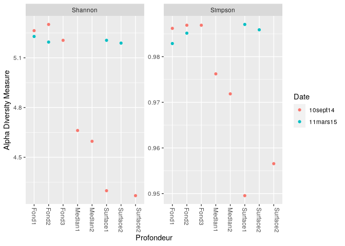
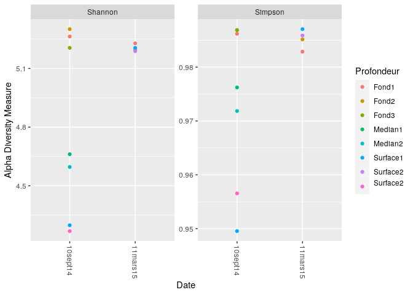
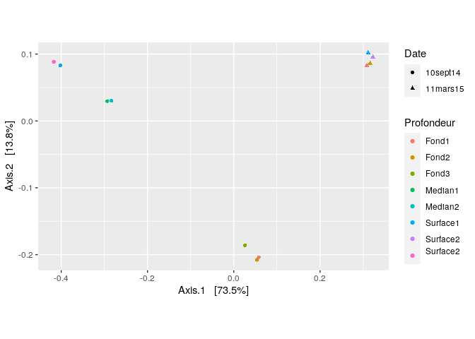
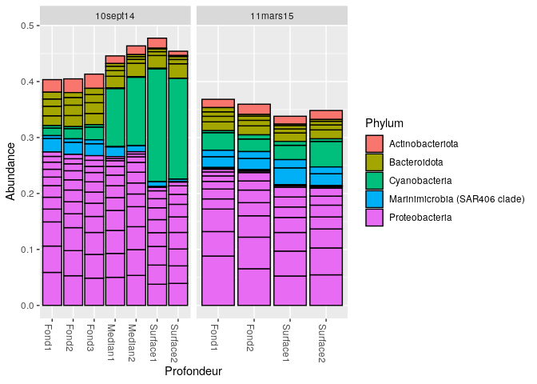

Analyse des donées avec Phyloseq
================
Vincent Noah
19 decembre 2020

  - [Mise en place des données
    Phyloseq.](#mise-en-place-des-données-phyloseq.)
  - [Création de l’objet phyloseq.](#création-de-lobjet-phyloseq.)
  - [Visualisation de l’alpha
    diversité.](#visualisation-de-lalpha-diversité.)
  - [Analyse en coordonnées
    principales.](#analyse-en-coordonnées-principales.)
  - [Représentation des données en graphique en
    bar.](#représentation-des-données-en-graphique-en-bar.)

# Mise en place des données Phyloseq.

Afin de pouvoir continuer l’analyse , on charge l’image des données
traités avec Dada2 et on indique a R de séparer les données, pour que
l’on puisse les analyser avec phyloseq. Il est donc important de
charger toutes les library nécessaires.

``` r
library(dada2)
```

    ## Loading required package: Rcpp

    ## Warning: multiple methods tables found for 'which'

``` r
library(phyloseq)
library(Biostrings)
```

    ## Loading required package: BiocGenerics

    ## Loading required package: parallel

    ## 
    ## Attaching package: 'BiocGenerics'

    ## The following objects are masked from 'package:parallel':
    ## 
    ##     clusterApply, clusterApplyLB, clusterCall, clusterEvalQ,
    ##     clusterExport, clusterMap, parApply, parCapply, parLapply,
    ##     parLapplyLB, parRapply, parSapply, parSapplyLB

    ## The following objects are masked from 'package:stats':
    ## 
    ##     IQR, mad, sd, var, xtabs

    ## The following objects are masked from 'package:base':
    ## 
    ##     anyDuplicated, append, as.data.frame, basename, cbind, colnames,
    ##     dirname, do.call, duplicated, eval, evalq, Filter, Find, get, grep,
    ##     grepl, intersect, is.unsorted, lapply, Map, mapply, match, mget,
    ##     order, paste, pmax, pmax.int, pmin, pmin.int, Position, rank,
    ##     rbind, Reduce, rownames, sapply, setdiff, sort, table, tapply,
    ##     union, unique, unsplit, which.max, which.min

    ## Loading required package: S4Vectors

    ## Loading required package: stats4

    ## 
    ## Attaching package: 'S4Vectors'

    ## The following object is masked from 'package:base':
    ## 
    ##     expand.grid

    ## Loading required package: IRanges

    ## 
    ## Attaching package: 'IRanges'

    ## The following object is masked from 'package:phyloseq':
    ## 
    ##     distance

    ## Loading required package: XVector

    ## 
    ## Attaching package: 'Biostrings'

    ## The following object is masked from 'package:base':
    ## 
    ##     strsplit

``` r
library(ggplot2)
```

``` r
load("02_Data-analysis-with-DADA2_FinalEnv")

samples.out <- rownames(seqtab.nochim)
profondeur <- sapply(strsplit(samples.out, "_"), `[`, 2)
profondeur <- sapply(strsplit(samples.out, "_"), `[`, 3)
date <- substr(profondeur,1,11)
samdf <- data.frame(Profondeur=profondeur,Date=date)
samdf$Profondeur <- c("Fond1","Fond1","Fond2","Fond2","Fond3","Median1","Median2","Surface1","Surface1","Surface2
","Surface2")
samdf$Date[samdf$Profondeur==11] <- c("Mars","Sept")
rownames(samdf) <- samples.out
```

# Création de l’objet phyloseq.

``` r
ps <- phyloseq(otu_table(seqtab.nochim, taxa_are_rows=FALSE),
 sample_data(samdf),
 tax_table(taxa))
ps <- prune_samples(sample_names(ps), ps)
ps
```

    ## phyloseq-class experiment-level object
    ## otu_table()   OTU Table:         [ 1522 taxa and 11 samples ]
    ## sample_data() Sample Data:       [ 11 samples by 2 sample variables ]
    ## tax_table()   Taxonomy Table:    [ 1522 taxa by 7 taxonomic ranks ]

``` r
dna <- Biostrings::DNAStringSet(taxa_names(ps))
names(dna) <- taxa_names(ps)
ps <- merge_phyloseq(ps, dna)
taxa_names(ps) <- paste0("ASV", seq(ntaxa(ps)))
ps
```

    ## phyloseq-class experiment-level object
    ## otu_table()   OTU Table:         [ 1522 taxa and 11 samples ]
    ## sample_data() Sample Data:       [ 11 samples by 2 sample variables ]
    ## tax_table()   Taxonomy Table:    [ 1522 taxa by 7 taxonomic ranks ]
    ## refseq()      DNAStringSet:      [ 1522 reference sequences ]

# Visualisation de l’alpha diversité.

La diversité alpha est un indicateur de la biodiversité. Il permet de
mettre en évidence la diversité dans un milieu donné, à un moment donné
à travers de nombreux indices. L’indice de Shannon permet de rendre
compte le nombre d’espèces ainsi que leur abondance. L’indice de Simpson
quant à lui permet de mettre en évidence la richesse de la diversité de
par la dominance des espèces. On observe, qu’il y a un indice d’alpha
diversité plus qu’il y a un indice d’alpha diversité de Shannon plus
élevé pour les fonds que la surface le 10 septembre 2014. Autrement
dit, il y a une meilleure richesse de la biodiversité au niveau des
fonds plutôt qu’à la surface en septembre. Cependant le 11 mars 2015 on
observe une autre tendance. En effet, il y a une augmentation de la
biodiversité pour la surface. Autrement dit, en mars, certains
paramètres permettent une augmentation de la diversité au niveau de la
surface. L’indice de Simpson nous montre que la surface possède plus
d’espèces même si ce n’est pas très significatif. En effet plus
l’indice de Simpson est faible, moins il y a de probabilités de tirer
deux fois la même espèce, et donc une plus grande diversité (notamment
pour la surface 1). Comme l’indice augmente en fonction de la
profondeur, on peut en conclure qu’il y a moins de diversité, ou
autrement dit, que certaines espèces sont dominantes en fonction de la
profondeur. Cependant on observe le même phénomène que pour l’indice de
Shannon. En effet, la diversité semble changer en fonction de la date.
Le 10 septembre 2014, on observe une meilleure richesse (moins de
dominance) au niveau de la surface qu’au niveau des fonds tandis que le
11 mars 2015 on remarque une augmentation pour la surface.

``` r
plot_richness(ps, x="Profondeur", measures=c("Shannon", "Simpson"),
color="Date")
```

<!-- -->

``` r
plot_richness(ps, x="Date", measures=c("Shannon", "Simpson"),
color="Profondeur")
```

<!-- -->

# Analyse en coordonnées principales.

Le graphique représente une PCOA (Principal coordinate analysis), c’est
une

approche basée sur les rangs. Autrement dit, plus les objets sont
semblables les uns aux autres, plus ils seront représentés proches les
uns des autres. Cette technique permet de représenter la dissimilarité.
Les deux axes évaluent le pourcentage de variance et traduisent la
variabilité de nos données. Cette matrice de distance est réalisée grâce
au coefficient de dissimilarité de Bray curtis. Lorsque deux
échantillons sont identiques, l’indice tend vers 0 et lorsque deux
échantillons sont dissemblables, l’indice tend vers 1.

On observe en hiver, que les communautés se trouvant à la surface ou en
profondeur, sont relativement proches. Tandis qu’en été, on remarque le
phénomène inverse. En effet, les communautés en surface sont proches
entre elles, de même pour la communauté de profondeur moyenne et
profonde. Cependant on observe une forte dissimilarité entre les
communautés à la surface, et en profondeur.

Cela pourrait peut-être s’expliquer par des courants plus forts ou des
intempéries beaucoup plus présentes et violentes en hiver.

``` r
which(!rowSums(otu_table(ps)) > 1000)
```

    ## named integer(0)

``` r
ps <- prune_samples(rowSums(otu_table(ps)) > 1000, ps)
pslog <- transform_sample_counts(ps, function(x) log(1 + x))
```

Maintenant les échantillons sont analyser par une PCoA avec une distance
de Bray-Curtis. Comme pour les indices d’alpha diversité, il en ressort
que les communauté bactériennes se rassemble par date. Ce qui est
notable, les échantillons du 10 septembres sont plus distinct entre
chaque profondeur.

``` r
out.pcoa.log <- ordinate(pslog, method = "MDS", distance = "bray")
evals <- out.pcoa.log$values[,1]
plot_ordination(pslog, out.pcoa.log, color = "Profondeur",
shape = "Date") +
labs(col = "Profondeur", shape = "Date")+
coord_fixed(sqrt(evals[2] / evals[3]))
```

<!-- -->

# Représentation des données en graphique en bar.

Lorsque l’on représente les données sous forme de graphique en bar
(répartition des 20 phylas les plus abaondant) en fonction du phylum,
on observe une répartition différente en fonction des profondeurs et de
la date. On observe 5 phylas; Proteobacteria, Cyanobacteria,
Marinimicrobia, Bacteroidota et les Actinobacteriota. Le 10 septembre
2014, on observe que les deux phylas principales sont les Proteobacteria
et les Cyanobacteria, avec une quasi absence des Marinimicrobia.
Cependant, on observe que plus on descend en profondeur, moi il y a de
Cyanobacteria et plus il y a de Proteobacteria , avec une légère
augmentation pour les Marinimicrobia. Quant aux Actinobacteriota et aux
Bacteroidota, On observe aussi cette tendance. Si l’on compare ces
résultats avec les indices d’alpha diversité précédent, on observait un
plus grand indice de Shannon pour la surface. Le graphique en bar nous
montre que les Cyanobacteria sont très présents à la surface ce qui
devrait augmenter cet indice, contrairement aux fonds où ils sont
quasiment absents. Mais comme l’indice de Shannon tient compte du nombre
d’espèces et de leur abondance, on peut en conclure que le phylum des
Proteobacteria serait beaucoup plus diversifié en profondeur, et donc
qu’il y aurait beaucoup plus d’espèces en profondeur, malgré la
présence du phylum de Cyanobacteria en surface. Pour l’indice de
Simpson on pourrait en conclure qu’il y a plus de phyla en surface, on a
donc moins de chance de tomber plusieurs fois sur la même espèce, et
inversement avec les fonds ou il y a une dominance du phylum
Proteobacteria ce qui explique l’indice de Simpson plus élevé. Mais
l’indice de Simpson reste tout de même très élevé, ce qui n’est pas
très significatif.

Le 11 mars 2015 on remarque une répartition différente. En effet, on
observe une répartition similaire pour toutes les phylas exceptées pour
les Cyanobacteria qui sont beaucoup moins présentes en surface. De plus
on observe qu’en mars 2015, il y avait une répartition en fonction de la
profondeur similaire pour les Cyanobacteria.

Les Cyanobacteria sont des bactéries phototrophes. Il paraît donc normal
de les trouver nettement plus abondantes en surface, là où la lumière
est la plus présente. Cependant comment peut-on expliquer la différence
entre deux saisons (été et hiver) ?

En effet on observe une plus forte abondance des cyanobactéries en été
qu’en hiver. Cela pourrait s’expliquer par le temps d’ensoleillement de
ces mois respectifs, étant nettement supérieur en septembre qu’en mars.
De plus, la température de l’eau pourrait être un facteur limitant pour
les cyanobactéries. En effet elle est relativement plus élevée en
septembre qu’en mars.

Pour les Proteobacteria on observe une dominance qu’importe les saisons
et la profondeur. C’est un phylum ou on retrouve de très nombreuses
bactéries, possédant de nombreuses caractéristiques (bactérie pourpre,
sulfureuse, dotée de nombreux pigments etc..). Ce sont donc des
bactéries qui peuvent de par leur nombre et leurs caractéristiques
colonisées de nombreux environnements, ce qui explique leur abondance.

Quant aux Marinimicrobia, on observe une répartition en été qui augmente
avec la profondeur. Or les Marinimicrobia sont un groupe de bactéries se
développent dans des environnements faiblement oxygénés. Or l’O2 diminue
avec la profondeur, ce qui est en accord avec les résultats. L’oxygène
est donc un facteur très important pour le développement des bactéries.
Cependant en hiver, on observe autant de Marinimicrobia à la surface
qu’en profondeur, ce qui est assez surprenant.

Les conditions plus favorables en été (température, lumière etc)
permettent une augmentation de la diversité, contrairement à l’hiver.

``` r
top20 <- names(sort(taxa_sums(ps), decreasing=TRUE))[1:20]
ps.top20 <- transform_sample_counts(ps, function(OTU) OTU/sum(OTU))
ps.top20 <- prune_taxa(top20, ps.top20)
plot_bar(ps.top20, x="Profondeur", fill="Phylum") + facet_wrap(~Date, scales="free_x")
```

<!-- -->

\#Conclusion

À travers cette analyse, on a observé que la profondeur et les saisons,
modifiaient de nombreux paramètres, qui influence la structure des
communautés planctoniques de la rade de Brest. En surface, les
conditions sont beaucoup plus favorables qu’en profondeur. En effet on
retrouve à la surface de la lumière, de l’oxygène, des températures plus
élevées etc., ce qui permet une plus grande richesse de la diversité.
C’est pour cela aussi qu’en été il y a plus d’abondance, car ces
conditions sont plus présentes qu’en hiver. C’est surement pour cela que
l’on retrouve des communautés très proches en hiver en fonction de la
profondeur, car ces organismes, étant planctonique, se laissent guider
par le courant, or en hiver le courant et les tempêtes sont plus forts.
Cependant, certains microorganismes possèdent de nombreuses
spécificités, notamment métaboliques, ce qui leur permet d’être
omniprésent sur tous les milieux, qu’importe les conditions (anoxique,
faible température, pas de lumière etc) la profondeur, comme les
protéobactéries.
